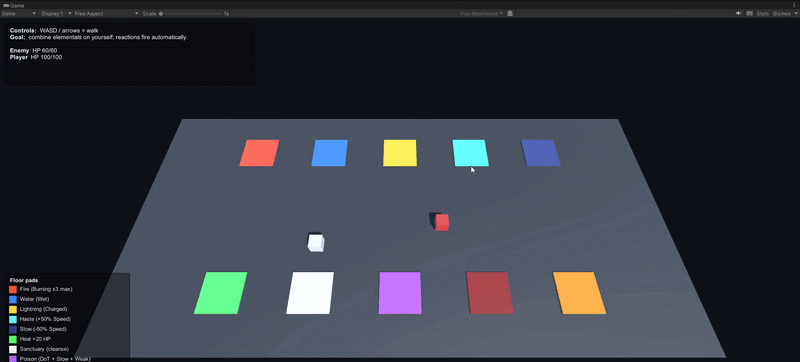

# Effectio

A `netstandard2.0` C# simulation layer for **stats, modifiers, effects, statuses, and reactions** - the building blocks behind damage-over-time, auras, conditional buffs, and elemental interactions like *fire + water = vaporize*. Drop it into a .NET game, a Unity project, or a headless server; it does not care.

- **Lightweight** - no runtime reflection; the engines reuse pooled buffers so `Tick` only allocates the modifier / effect instances the game itself asks to be created.
- **Deterministic** - one `Tick(deltaTime)` entry point drives the whole simulation.
- **Extensible** - every pipeline point (modifier kinds, effect actions, triggers, reaction results) is an interface you can implement.
- **Unity-friendly** - targets `netstandard2.0`, zero runtime dependencies, no Unity-API coupling in the core.

---

## Table of contents

- [Why Effectio exists](#why-effectio-exists)
- [Library structure](#library-structure)
- [Installation](#installation)
- [Quick start (pure C#)](#quick-start-pure-c)
- [Unity integration](#unity-integration)
  - [Bootstrap MonoBehaviour](#bootstrap-monobehaviour)
  - [Per-character component](#per-character-component)
  - [Tiny combat demo](#tiny-combat-demo)
- [Stats & modifiers](#stats--modifiers)
- [Effects & custom actions](#effects--custom-actions)
- [Statuses & immunities](#statuses--immunities)
- [Reactions](#reactions)
- [Triggers](#triggers)
- [The game loop](#the-game-loop)
- [Events](#events)
- [Performance](#performance)
- [Packaging plan](#packaging-plan)
- [License](#license)

---

## Why Effectio exists

Any RPG / ARPG / roguelike ends up reimplementing the same five things: numbers that change over time, buffs that stack and expire, status tags that gate behaviour, and cross-status reactions. Every time you write them from scratch the gameplay team asks for "just one more" edge case (a trigger, a new modifier kind, a status that reacts to another status) and the code bends until it breaks.

Effectio is the layer you write **once** so the game code only expresses the design, not the machinery. The machinery is:

- **Priority-ordered polymorphic modifier pipeline** so `Base -> +flat -> *mult -> +cap -> clamp` is one loop, and adding a new kind is one class.
- **Polymorphic effect actions / triggers / reaction results** so a switch over an enum is never the thing that grows.
- **A single `Tick(dt)`** - easy to drive from `Update`, a fixed timestep, a server loop, or a replay system.
- **Event hooks** on every engine so UI, VFX, and SFX subscribe without reaching into the simulation.

---

## Library structure

```
 +------------------------- EffectioManager (facade) -------------------------+
 |                                                                            |
 |   Tick(dt) ------------------------------------------------------+         |
 |                                                                  v         |
 |   +--------------+   +---------------+  +------------------+               |
 |   | StatusEngine |   | EffectsEngine |  | ReactionEngine   |               |
 |   |              |   |               |  |                  |               |
 |   | apply/remove |   | Instant       |  | matches required |               |
 |   | stacking     |   | Timed         |  | statuses / tags  |               |
 |   | durations    |   | Periodic      |  | fires results    |               |
 |   | immunity     |   | Aura (undo)   |  | can chain        |               |
 |   | tick effects |   | Triggered     |  |                  |               |
 |   +------+-------+   +------+--------+  +--------+---------+               |
 |          |                  |                    |                         |
 |          v                  v                    v                         |
 |   +------------------------ IEffectioEntity --------------------------+    |
 |   |                                                                  |    |
 |   |   IStat(s)                                                       |    |
 |   |     +-- IModifier[]  --> AdditiveModifier (P=100)                |    |
 |   |                          MultiplicativeModifier (P=200)          |    |
 |   |                          CapAdjustmentModifier (P=300)           |    |
 |   |                          <your custom subclass>                  |    |
 |   |                                                                  |    |
 |   |   active status keys  --> HashSet<string>                        |    |
 |   +------------------------------------------------------------------+    |
 |                                                                            |
 |   Polymorphism points (each is an interface + built-ins + your types):     |
 |     IEffectAction       : AdjustStat / ApplyModifier / ApplyStatus / ...   |
 |     ITriggerCondition   : StatBelow / HasStatus / And / Or / Not / ...     |
 |     IReactionResult     : ApplyStatus / AdjustStat / ApplyEffect / ...     |
 |                                                                            |
 +----------------------------------------------------------------------------+
```

Every subsystem is reachable from the manager (`manager.Stats...`, `manager.Effects...`, `manager.Statuses...`, `manager.Reactions...`). You can also use the engines directly if you want them without a manager.

---

## Installation

Effectio is a plain `netstandard2.0` DLL with no dependencies - so you have options:

### A. Drop the DLL into a Unity project

1. Build `Effectio.csproj` in Release.
2. Copy `bin/Release/netstandard2.0/Effectio.dll` into `Assets/Plugins/`.
3. Unity imports it like any other managed plugin. Done.

### B. Unity Package Manager (git URL)

In `Packages/manifest.json`:

```json
{
  "dependencies": {
    "com.forget-me-not-nc.effectio": "https://github.com/forget-me-not-nc/Effectio.git?path=/Effectio#main"
  }
}
```

(Requires a `package.json` in the `Effectio/` folder - see [Packaging plan](#packaging-plan).)

### C. NuGet (pure .NET, or Unity via NuGetForUnity)

For server code, tests, or a tools assembly:

```bash
dotnet add package Effectio
```

Unity users can install [NuGetForUnity](https://github.com/GlitchEnzo/NuGetForUnity) and consume the same NuGet package directly in the editor.

### D. Project reference

Clone this repo and add a `<ProjectReference>` to `Effectio/Effectio.csproj` from your own solution.

---

## Quick start (pure C#)

```csharp
using Effectio.Core;
using Effectio.Stats;
using Effectio.Builders;

var manager = new EffectioManager();

var player = manager.CreateEntity("player");
player.AddStat(new Stat("Health", baseValue: 100f, min: 0f, max: 100f));
player.AddStat(new Stat("Damage", baseValue: 25f));

// Instant heal
var heal = EffectBuilder.Create("Heal").Instant().AdjustStat("Health", 20f).Build();
manager.Effects.ApplyEffect(player, heal);

// Game loop
manager.Tick(deltaTime: 0.016f);
```

That is the whole integration surface. Everything below is about *what you can express* with it.

---

## Unity integration

Effectio does not know what Unity is. You glue it on top with three small pieces:

1. A **bootstrap** `MonoBehaviour` that owns the single `EffectioManager` for the scene.
2. A **per-character component** that mirrors a `GameObject` to an `IEffectioEntity`.
3. Your gameplay code calls into `manager.Effects` / `manager.Statuses` whenever something happens.

### Bootstrap MonoBehaviour

Put one of these in your scene (or make it a `DontDestroyOnLoad` singleton):

```csharp
using UnityEngine;
using Effectio.Core;
using Effectio.Builders;
using Effectio.Statuses;

public class EffectioWorld : MonoBehaviour
{
    public static EffectioWorld Instance { get; private set; }
    public EffectioManager Manager { get; private set; }

    void Awake()
    {
        if (Instance != null) { Destroy(gameObject); return; }
        Instance = this;
        DontDestroyOnLoad(gameObject);

        Manager = new EffectioManager();
        RegisterCatalog();
    }

    void Update()
    {
        // One call per frame drives the whole simulation.
        Manager.Tick(Time.deltaTime);
    }

    void RegisterCatalog()
    {
        // Statuses the whole game knows about.
        Manager.Statuses.RegisterStatus(StatusBuilder.Create("Burning")
            .WithTags("Fire", "Elemental")
            .WithDuration(5f).WithTickInterval(1f)
            .OnTick(EffectBuilder.Create("burn_tick").Instant().AdjustStat("Health", -5f))
            .Build());

        Manager.Statuses.RegisterStatus(StatusBuilder.Create("Wet")
            .WithTags("Water").WithDuration(5f).Build());

        Manager.Statuses.RegisterStatus(new Status("Stunned", duration: 2f));

        // Elemental reaction: fire + water = vaporize.
        Manager.Reactions.RegisterReaction(ReactionBuilder.Create("Vaporize")
            .RequireStatuses("Burning", "Wet")
            .ConsumesStatuses()
            .AdjustStat("Health", -40f)
            .ApplyStatus("Stunned")
            .Build());
    }
}
```

### Per-character component

```csharp
using UnityEngine;
using Effectio.Entities;
using Effectio.Stats;

/// <summary>Binds this GameObject to an Effectio entity and exposes helper properties.</summary>
public class CharacterStats : MonoBehaviour
{
    [SerializeField] float _maxHealth = 100f;
    [SerializeField] float _baseDamage = 15f;

    public IEffectioEntity Entity { get; private set; }

    public float Health => Entity.GetStat("Health").CurrentValue;
    public bool IsAlive => Health > 0f;

    void Start()
    {
        var world = EffectioWorld.Instance.Manager;

        Entity = world.CreateEntity(name + "_" + GetInstanceID());
        Entity.AddStat(new Stat("Health", _maxHealth, 0f, _maxHealth));
        Entity.AddStat(new Stat("Damage", _baseDamage));

        // Die when Health crosses 0 - Effectio fires OnValueChanged, Unity handles the rest.
        Entity.GetStat("Health").OnValueChanged += (_, _, newHp) =>
        {
            if (newHp <= 0f && isActiveAndEnabled) Die();
        };
    }

    void OnDestroy()
    {
        // Clean up the simulation when the GameObject is gone.
        EffectioWorld.Instance?.Manager.RemoveEntity(Entity.Id);
    }

    void Die()
    {
        Debug.Log(name + " died");
        Destroy(gameObject);
    }
}
```

### Tiny combat demo

A fire-and-forget spellcaster. Press `F` to cast Fire on a nearby enemy, `W` to splash Water. If an enemy gets both, Vaporize triggers automatically and deals burst damage + stun.

```csharp
using UnityEngine;
using Effectio.Builders;

public class Spellcaster : MonoBehaviour
{
    [SerializeField] CharacterStats _target;

    void Update()
    {
        if (_target == null || !_target.IsAlive) return;

        if (Input.GetKeyDown(KeyCode.F)) CastFire();
        if (Input.GetKeyDown(KeyCode.W)) CastWater();
    }

    void CastFire()
    {
        var fire = EffectBuilder.Create("fireball")
            .Instant()
            .ApplyStatus("Burning")
            .Build();
        EffectioWorld.Instance.Manager.Effects.ApplyEffect(_target.Entity, fire);
        Debug.Log("Cast Fire on " + _target.name + " (HP " + _target.Health.ToString("0") + ")");
    }

    void CastWater()
    {
        var water = EffectBuilder.Create("splash")
            .Instant()
            .ApplyStatus("Wet")
            .Build();
        EffectioWorld.Instance.Manager.Effects.ApplyEffect(_target.Entity, water);
        Debug.Log("Cast Water on " + _target.name + " (HP " + _target.Health.ToString("0") + ")");
    }
}
```

What happens when you press `F` then `W`:

1. Fire applies `Burning` -> `OnStatusApplied` fires -> `ReactionEngine.CheckReactions` runs, no match yet.
2. Water applies `Wet` -> `OnStatusApplied` fires -> reaction check finds `Vaporize` (needs both), fires it.
3. Vaporize consumes both statuses, deals -40 HP, applies `Stunned`.
4. `Stat.OnValueChanged` fires on Health -> your UI updates / particles play.
5. Two seconds later, `Stunned` expires and `OnStatusExpired` fires.

All of that is driven by the **one** `Manager.Tick(Time.deltaTime)` in `EffectioWorld.Update`.

### Authoring tip

You can make `EffectBuilder` / `StatusBuilder` / `ReactionBuilder` calls once at bootstrap and cache the resulting `IEffect` / `IStatus` / `IReaction` in a `ScriptableObject` for designer-editable content (without any serialization dependency). The optional `Effectio.Unity` package - see [Packaging plan](#packaging-plan) - formalises that pattern.

### Runnable sample

A full **walkable** demo lives at [`samples/UnityDemo`](samples/UnityDemo) in this repository. It references Effectio by local `file:` path so edits to the core show up in Unity immediately. Open the folder in Unity Hub (2022.3 LTS), add a `DemoBootstrap` component to an empty GameObject, press Play, and walk a cube onto coloured floor pads to apply elemental statuses; five reactions (`Vaporize`, `Electrocuted`, `Overload`, `Frostbite`, `Apocalypse`) fire automatically when statuses combine.



---

## Stats & modifiers

Stats apply their modifiers in a single priority-ordered pass, then clamp to `[Min, effectiveMax]`. Built-in priority bands:

| Kind | Priority | Effect |
|---|---:|---|
| `AdditiveModifier` | 100 | `value += Value` |
| `MultiplicativeModifier` | 200 | `value *= Value` |
| `CapAdjustmentModifier` | 300 | widens `EffectiveMax` |
| *your subclass* | any `int` | whatever you implement |

```csharp
using Effectio.Modifiers;
using Effectio.Builders;

var dmg = player.GetStat("Damage");

// +10 flat for 5s, sourced from "SpellBuff"
dmg.AddModifier(new AdditiveModifier("spell_bonus", 10f, duration: 5f, sourceKey: "SpellBuff"));

// +20% while it lasts, via the fluent builder
dmg.AddModifier(ModifierBuilder.Create("rage")
    .Multiplicative(1.2f).WithDuration(5f).FromSource("SpellBuff").Build());

// Remove everything from a given source
dmg.RemoveModifiersFromSource("SpellBuff");
```

Defining a new modifier kind is one class:

```csharp
public sealed class OverrideModifier : ModifierBase
{
    private readonly float _value;
    public override int Priority => ModifierPriority.Override; // 50 - before Additive
    public OverrideModifier(string key, float value, float duration = -1f, string sourceKey = null)
        : base(key, duration, sourceKey) => _value = value;
    public override void Apply(ref StatCalculationContext ctx) => ctx.Value = _value;
}
```

Modifier durations tick automatically inside `EffectioManager.Tick(dt)`.

---

## Effects & custom actions

Five lifecycle kinds, each producible via `EffectBuilder`:

```csharp
// Timed buff that expires after 3s
EffectBuilder.Create("Shout").Timed(3f).AdjustStat("Damage", 5f).Build();

// DoT: -2 HP every second for 5s
EffectBuilder.Create("Poison").Periodic(duration: 5f, tickInterval: 1f).AdjustStat("Health", -2f).Build();

// Aura: +30 Armor while active, reverted on removal or expiration
EffectBuilder.Create("GuardAura").Aura(duration: 10f).AdjustStat("Armor", 30f).Build();

// Triggered: apply "Berserk" the first time Health drops below 30
EffectBuilder.Create("LastStand")
    .Triggered(duration: 60f).ApplyStatus("Berserk")
    .WhenStatBelow("Health", 30f).Build();
```

`ApplyModifier` accepts any `IModifier` kind via a factory (each execution gets a fresh instance):

```csharp
EffectBuilder.Create("Rage").Timed(5f)
    .ApplyModifier("Damage", e => new MultiplicativeModifier(e.Key + "_mod", 2f, e.Duration, e.Key))
    .Build();
```

For bespoke behaviour, implement `IEffectAction` and plug it in:

```csharp
public sealed class LifestealAction : IEffectAction
{
    readonly string _hp;
    readonly float _percent;
    public LifestealAction(string hpStat, float percent) { _hp = hpStat; _percent = percent; }

    public void Execute(in EffectActionContext ctx)
    {
        var hp = ctx.Entity.GetStat(_hp);
        hp.BaseValue += hp.CurrentValue * _percent;
        hp.Recalculate();
    }
    public void Undo(in EffectActionContext ctx) { /* not reversible */ }
}

EffectBuilder.Create("Lifesteal").Timed(5f)
    .WithAction(new LifestealAction("Health", 0.05f)).Build();
```

Aura / Timed effects call `Undo` automatically on expiration or manual removal.

---

## Statuses & immunities

```csharp
var burning = StatusBuilder.Create("Burning")
    .WithTags("Fire", "Elemental")
    .WithDuration(5f).Stackable(3).WithTickInterval(1f)
    .OnTick(EffectBuilder.Create("burn_tick").Instant().AdjustStat("Health", -3f))
    .OnRemove(EffectBuilder.Create("burn_off").Instant().RemoveStatus("Burning"))
    .Build();

manager.Statuses.RegisterStatus(burning);
manager.Statuses.ApplyStatus(player, "Burning");
```

```csharp
manager.Statuses.GrantImmunity(player, "Poison");
manager.Statuses.OnStatusBlocked += (e, key) => Debug.Log(e.Id + " immune to " + key);
manager.Statuses.ApplyStatus(player, "Poison"); // silently blocked, fires OnStatusBlocked
manager.Statuses.RevokeImmunity(player, "Poison");
```

---

## Reactions

Reactions fire when all required statuses / tags coexist on an entity:

```csharp
var vaporize = ReactionBuilder.Create("Vaporize")
    .RequireStatuses("Burning", "Wet")
    .ConsumesStatuses()              // both statuses get removed
    .AdjustStat("Health", -50f)      // burst damage
    .ApplyStatus("Stunned")
    .Build();

manager.Reactions.RegisterReaction(vaporize);
manager.Statuses.ApplyStatus(player, "Burning");
manager.Statuses.ApplyStatus(player, "Wet");  // -> Vaporize fires automatically
```

Reactions can chain: if a reaction applies a new status that satisfies another reaction, it fires in the same tick up to `manager.Reactions.MaxChainDepth` (default 5).

Custom reaction outcomes: implement `IReactionResult` and pass it via `ReactionBuilder.WithResult(...)`.

---

## Triggers

`Triggered` effects fire once the first time their condition is true. Built-in conditions cover stat thresholds and status presence; composites let you combine them without writing code:

```csharp
using Effectio.Effects.Triggers;

EffectBuilder.Create("TacticalHeal").Triggered(duration: 100f)
    .AdjustStat("Health", 15f)
    .When(new AndTrigger(
        new StatBelowTrigger("Health", 30f),
        new OrTrigger(new HasStatusTrigger("Focused"), new HasStatusTrigger("Rage"))))
    .Build();
```

Implement `ITriggerCondition` for anything the built-ins do not cover.

---

## The game loop

`EffectioManager.Tick(dt)` runs this exact sequence every call:

1. **Effect durations** decrement; periodic / triggered work is marked.
2. **Status durations** decrement; status tick-effects are marked.
3. **Per entity**:
   - stat modifiers tick (expired ones removed, stats recalculate);
   - pending effect ticks / trigger checks / aura undos run (this is where an `IEffectioEntity` is available);
   - pending status tick-effects apply.
4. **Status expirations** fire `OnRemoveEffects` and raise `OnStatusExpired`.

```csharp
void Update() => manager.Tick(Time.deltaTime);
```

---

## Events

Every engine exposes events for UI / VFX / SFX hookup:

```csharp
manager.Effects.OnEffectApplied += (entity, effect) => { /* ... */ };
manager.Effects.OnEffectTick    += (entity, effect) => { /* ... */ };
manager.Effects.OnEffectRemoved += (entity, effect) => { /* ... */ };

manager.Statuses.OnStatusApplied += (entity, key) => { /* ... */ };
manager.Statuses.OnStatusExpired += (entity, key) => { /* ... */ };
manager.Statuses.OnStatusBlocked += (entity, key) => { /* ... */ };

manager.Reactions.OnReactionTriggered += (entity, reaction) => { /* ... */ };

player.GetStat("Health").OnValueChanged += (stat, oldV, newV) => { /* UI update */ };
```

---

## Performance

Effectio is built to run inside a game tick. No runtime reflection, pooled hot-path buffers, and polymorphism instead of enum switches - the built-in pipelines do not allocate during a steady-state frame. Measured with BenchmarkDotNet on net8.0 Release, x64 RyuJIT:

| Scenario | Size | Mean | Allocated |
|---|--:|--:|--:|
| `Stat.Recalculate` (mixed modifier kinds) | 1 | 7 ns | 0 B |
| | 10 | 27 ns | 0 B |
| | 50 | 144 ns | 0 B |
| | 200 | 578 ns | 0 B |
| `Stat.TickModifiers` (permanent modifiers) | 10 | 44 ns | 0 B |
| | 100 | 350 ns | 0 B |
| `EffectioManager.Tick` - real mixed workload:<br/>DoT + timed buff + aura + triggered + burn status | 10 entities | 458 ns | 0 B |
| | 100 entities | 5.2 us | 0 B |
| | 1000 entities | 62 us | 0 B |

At **1000 entities on a 60 Hz game loop**, the whole simulation costs ~62 us - about **0.37 %** of the 16.6 ms frame budget, with zero GC pressure.

Reproduce:

```bash
dotnet run -c Release --project Effectio.Benchmarks -- --filter '*ManagerTickBenchmark*'
```

---

## Packaging plan

Effectio is designed as a **family of small packages** so teams install only what they need. The core stays dependency-free; anything optional lives in its own package.

```
Effectio                       core - IStat, IEffect, IStatus, IReaction, engines, builders.
                               netstandard2.0, zero dependencies.

Effectio.Serialization.Json    optional - DTO records + System.Text.Json loader.
                               Installed only by teams that author in JSON.

Effectio.Unity                 optional - ScriptableObject wrappers mirroring the DTOs,
                               MonoBehaviour helpers (EffectioWorld, CharacterStats).
                               Unity-only assembly.
```

**Why separate packages instead of one big one:**

- A team that serialises with Odin / YAML / MessagePack / custom binary should not pull in `System.Text.Json`.
- A server-side project (matchmaking, balance tools) never needs the Unity assembly.
- NuGet / UPM both make multi-package installs trivial. The cost is one extra line in `manifest.json` or `.csproj`.
- The core's "zero external DLLs in your build output" promise stays intact.

Distribution channels under this plan:

- **NuGet** - `Effectio`, `Effectio.Serialization.Json`, publishable with `dotnet pack` + `dotnet nuget push`.
- **OpenUPM / UPM git** - `com.forget-me-not-nc.effectio` plus optional `com.forget-me-not-nc.effectio.unity` with a `package.json` and sample scenes.
- **Release DLLs** - attached to GitHub Releases for teams that prefer the drop-in path.

---

## License

See [LICENSE.txt](LICENSE.txt).


